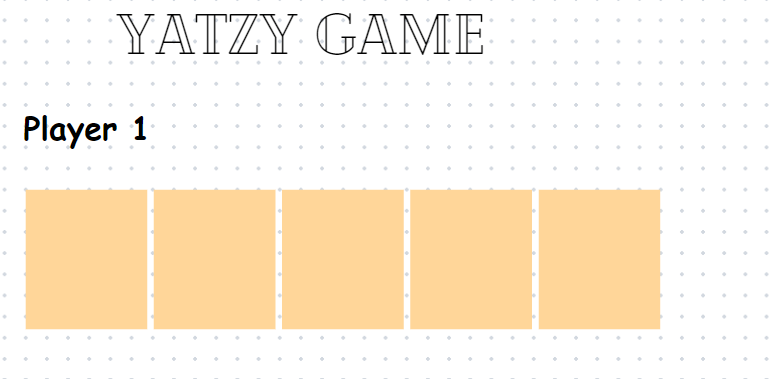
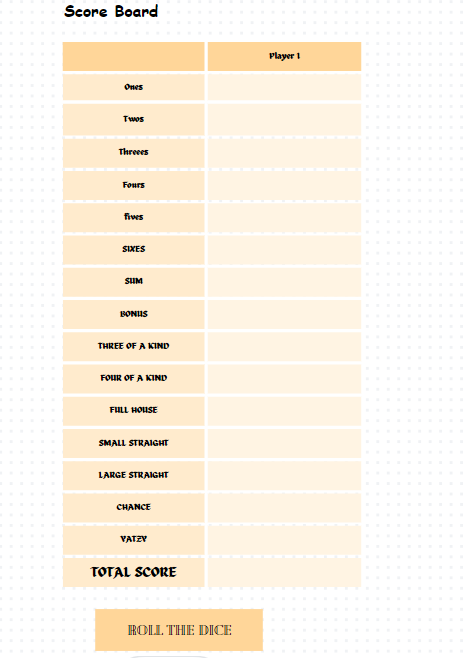

# Yatzy Game Design Documentation

## Introduction

This document outlines the design and style guide for our Yatzy game project. We'll follow a design system approach to ensure consistency, clarity, and a great user experience.

## Game Overview

Yatzy is a popular dice game with a combination of luck and strategy. Players roll dice to achieve specific combinations which have different fixed scores. The game consists of 13 rounds, and the goal is to score as many points as possible.

## Design System

### Colors Palette.
- Background color: #FFFFFF - Used for the background of the game
- Primary Color:#FFD699 - Used for headings, buttons, and dice.
- Secondary Color: #FFEBCD - Used for background and highlights.
- Tertiary Color: #FFF4E3 - Used for text and secondary elements.

### Typography
- Headings: Cheque - Large, clear headings for sections.
- Subheadings: Comic sans - Subtle and stylish subheadings.
- Body Text: Celandine - Simple and readable for instructions and content.
- Endheadings: Cheque-Large, Clear heading for section

### Dice Look and Feel

- Our Yatzy dice bring a unique blend of tradition and modern design. Each die boasts a crisp white color, with pips represented in our primary color. 
- The dice's rounded edges and shadow effect give them a 3D appearance, enhancing the overall user experience.
- The size of the digital dice should be large enough to be easily readable and interacted with on a screen, typically around 100x100 pixels.
- The pips on the die can be represented using black dots or numbers, typically in a standard layout, where the sum of the pips on opposing sides equals seven. 
- When the dice roll, you can create a simple animation to mimic the rolling motion. This can add to the excitement and realism of the game.

### Game Mock-ups
- 
  
- 

### Playing Instructions
- Objective: The goal of Yatzy is to score as many points as possible by rolling a set of five dice and achieving specific combinations on the scorecard.
Rules:
- Roll all five dice. You have three rolls in total for each turn to achieve your desired combination.
- After the first roll, you can choose to keep any dice with the desired values and set them aside. You can then re-roll the remaining dice.
- After the second roll, you can again choose which dice to keep and re-roll the rest.
- After the third roll, you must select one of the combinations on the scorecard (more on this below) to score in. If you have already filled all the slots on the scorecard, you must choose a zero score in one of the remaining categories.
- Your goal is to achieve the highest total score by the end of 13 rounds (13 turns). You will select a different combination to score in for each of the 13 rounds.

###Scoring Combinations:

- Here are the scoring combinations for Yatzy:

- Ones, Twos, Threes, Fours, Fives, Sixes: Score the sum of the corresponding dice values. For example, if you have three 3s, you can score 9 in the Threes category.
- Three of a Kind: Score the sum of all five dice if you have at least three of the same value.
- Four of a Kind: Score the sum of all five dice if you have at least four of the same value.
- Full House: Score 25 points if you have three of one value and two of another.
- Small Straight: Score 30 points if you have a sequence of four consecutive dice (e.g., 1-2-3-4 or 2-3-4-5).
- Large Straight: Score 40 points if you have a sequence of five consecutive dice (e.g., 1-2-3-4-5 or 2-3-4-5-6).
- Yatzy: Score 50 points if you have all five dice showing the same value.
- Chance: Score the sum of all five dice, regardless of the combination.
- Bonus: If your total score in the Ones through Sixes categories is 63 or more, you receive a 35-point bonus.
- Total Score: Calculate your total score by adding up all the points you've scored in each category.

## Conclusion
This design document serves as a foundation for our Yatzy game development. Following these guidelines ensures we deliver a game that's not only fun to play but also visually appealing and user-friendly.
    
